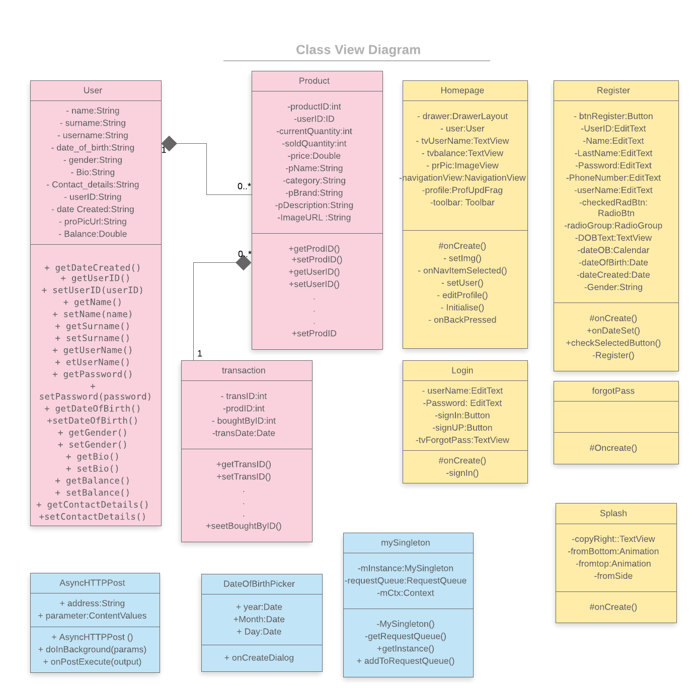

### SOFTWARE DESIGN WEB APPLICATION

> Building a market place app

## WE START WITH THE DIAGRAMS THAT DESCRIBE THE SYSTEM WE BUILDING
### Development View:
##### Component Diagram:
* This Digram show how the components of the system a linked to each other
* The customer needs to be authenticated who in turn also interacts with his account. The Custumor can again interact with the Ordering system which interacts with 2 other components, the cart component and the Payment Component of the system 

### Logical View:
##### The State diagram: 
* Which shows what states we have and how one moves from one state to the other. This is almost similar to the Process flow diagram which follows after this one. Unlike Takealot.com You need to first sign in to the system before you can start viewing the products, and that is the initial state of our system. If you do not have an account then you need to create one. But the state diagram is quite self explanatory.

##### The Class diagram:
* In The Below class diagram, We have 3 different types of classes
  1. The Blue box classes. These classes are helper classes which help up archive a certain task. The AsyncHTTPPost classes helps connect and communicate with the database, The MySingleton Class helps upload a picture to the server while storing the name of the picture in the database. The DatePicker class pops up the calendar when a user needs to select their date of birth.
  2.The Orange box classes. These are our activities, moving from the splash screen to the login page then depending on what the user wants to do, they can move to the homepage, registration activity or forgot password activity
  3.The Pink box classes; these are our main classes, We have a user which can have 0 or many products, and each product can be bought by 0 or 1 other user
  
  

### Physical View:
##### The Deployment Diagram
* This speaks to how the system works in the top level view. Speaks to how the System is deployed.
* In this instance We deploy it as a mobile app. Which we later might also deploy as a website.
* The end user uses the system as an android device. which communicates to the server through HTTP, Using PHP as a component of the the database management system, the server communicates to the an SQL database.
* Therefore every user needs to be connected to the internet one way or the other to be able to use the application

### Process View:
##### The Activity Diagram:
* Here we Describe step by step how does each  end user gets from loging in to successfully buying their product or selling a product. 
* We also go through how each user can and update their profile, change credentials and even upload a profile picture.

  ##### The sequence diagram
  * This diagram shows how the system works sequentially 

### Scenarios:

##### The USE CASE Diagram
* Below we show how a person is a user and what priveleges they have within the system.
* Not that administrator means a person selling a product, which gives them the ability to modify changes to their product or even delete their product completely if they choose not to sell it.
* The CLient is a user interested in buying goods from administrators. Each Admin is a client and each Client can be an admin if they choose to sell a product
* Being an Administrator doesn't mean you have to apply to become one. Once you have successfully logged in you can sell or buy goods

#### Decompostion Diagram:
The Below Diagram shows How the system Is decomposed into subsystems

